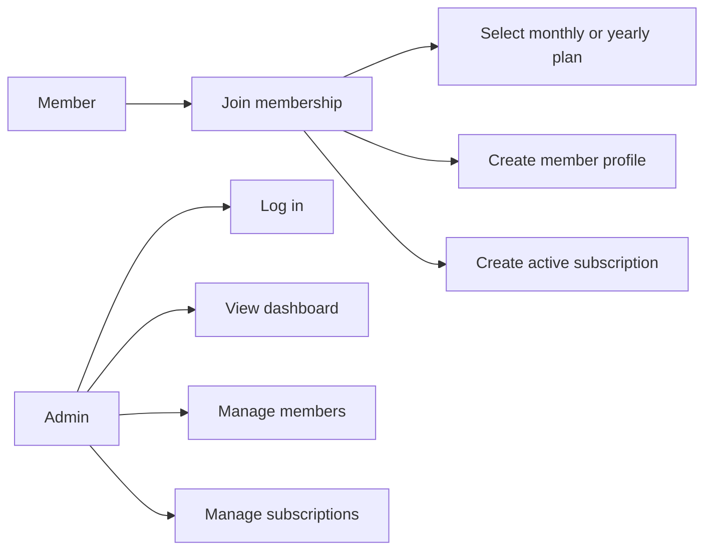
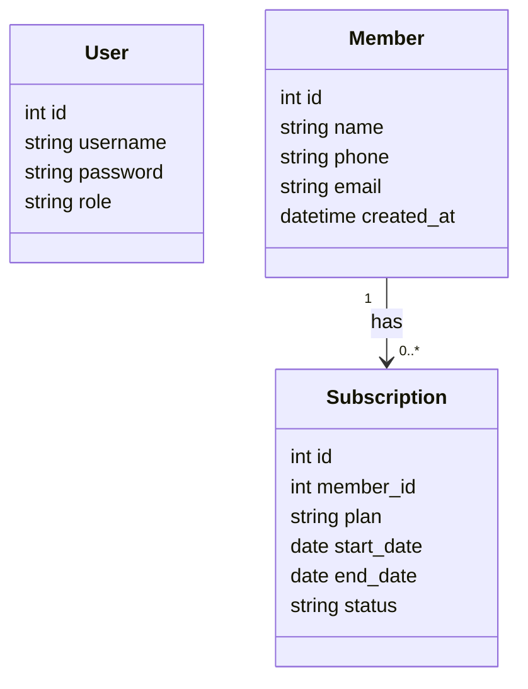
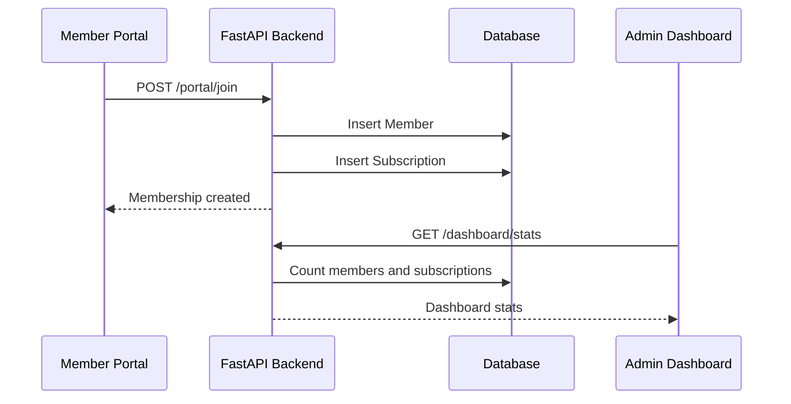

# FitHub

Professional Gym Management System built with FastAPI, SQLAlchemy, and a static HTML/CSS/JS frontend.

## Features

- Public member portal with membership plan selection.
- One-step member signup that creates both a member and a subscription.
- Admin authentication with JWT.
- Admin dashboard for members, subscriptions, and summary stats.
- Member CRUD and subscription management APIs.
- Automated tests and GitHub Actions CI.

## Default Admin Login

The app seeds a default admin user automatically when it starts:

```text
Username: admin
Password: admin123
```

You can override these values in `.env`:

```env
DEFAULT_ADMIN_USERNAME=admin
DEFAULT_ADMIN_PASSWORD=admin123
```

## Run Locally

```bash
pip install -r requirements.txt
python -m uvicorn app.main:app --reload
```

Open:

- Member portal: `http://127.0.0.1:8000/frontend/pages/index.html`
- Admin login: `http://127.0.0.1:8000/frontend/pages/login.html`
- API docs: `http://127.0.0.1:8000/docs`

## Member Flow

1. Open the member portal.
2. Choose Monthly or Yearly.
3. Submit name, phone, email, and plan.
4. The backend creates a member and an active subscription.
5. Log in as admin and open the dashboard to see updated stats.

## Tests

```bash
pytest -q
```

## Main API Routes

| Method | Route | Description |
| --- | --- | --- |
| `POST` | `/portal/join` | Public member signup and subscription creation |
| `POST` | `/auth/login` | Admin login |
| `GET` | `/dashboard/stats` | Dashboard summary stats |
| `GET` | `/members/` | List members |
| `POST` | `/members/` | Create member as admin |
| `GET` | `/subscriptions/` | List subscriptions |
| `POST` | `/subscriptions/` | Create subscription as admin |

## UML Use Case Diagram



## UML Class Diagram



## UML Sequence Diagram


